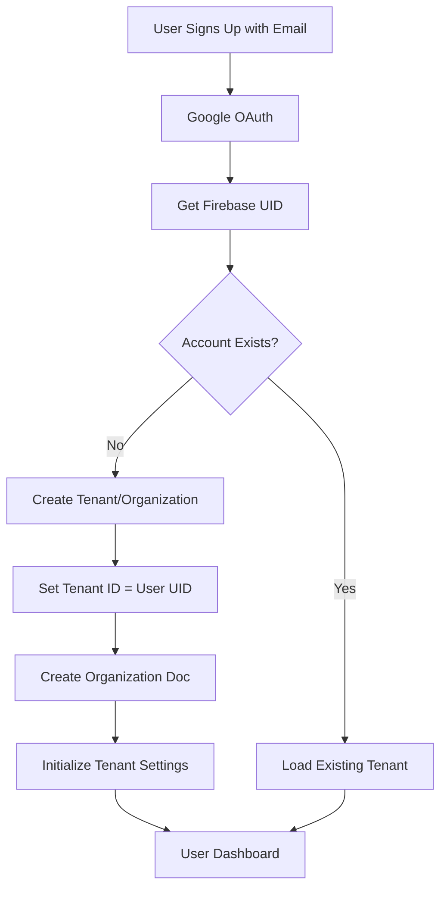
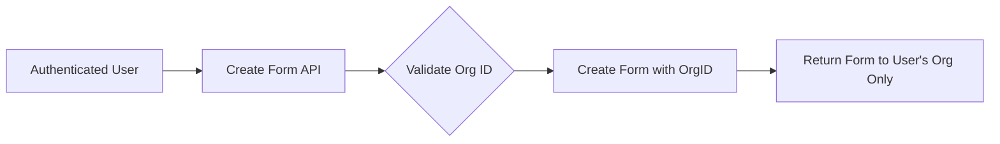
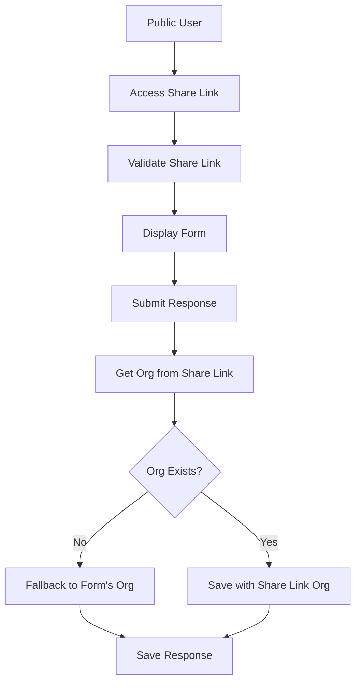
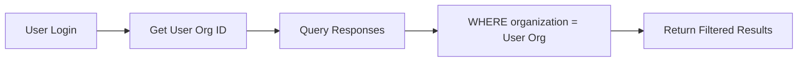

# Healthcare Forms Platform - Organization Architecture & Multi-Tenancy Documentation

## Executive Summary

This document outlines the current state, issues, and architectural design of the Healthcare Forms Platform's **Single-User Multi-Tenant Architecture**. The platform implements a **Flat Multi-Tenancy with Account-Based Isolation** model, designed to be HIPAA-compliant with strict data isolation between healthcare organizations. 

### Architecture Model: Single-User Tenant Model

**Core Design Principle**: **1 Email = 1 User = 1 Organization = 1 Tenant**

This is a simplified multi-tenant architecture where:
- Each account IS the tenant (no sub-users or user hierarchies)
- Complete flat structure with no relationships between tenants
- Tenant ID = User ID = Organization ID (unified identity model)
- Row-level security enforced through organization field in all collections
- Hard multi-tenancy with complete data isolation at the application layer

This model differs from traditional enterprise SaaS (like Slack or Microsoft 365) where organizations have multiple users. Instead, this is an **Account-Isolated Multi-Tenancy** pattern, ideal for individual healthcare practitioners or small practices where each account represents an independent, isolated tenant.

## Table of Contents
1. [Current Issues & Findings](#current-issues--findings)
2. [Organization Structure](#organization-structure)
3. [Multi-Tenancy Architecture](#multi-tenancy-architecture)
4. [HIPAA Compliance Requirements](#hipaa-compliance-requirements)
5. [Organization Onboarding Process](#organization-onboarding-process)
6. [Authentication & Authorization](#authentication--authorization)
7. [Data Flow & Isolation](#data-flow--isolation)
8. [Recommendations & Next Steps](#recommendations--next-steps)

---

## Current Issues & Findings

### Issue 1: Organization Mismatch in Form Submissions

**Problem**: Form submissions are not appearing in the user's dashboard despite successful submission (201 status).

**Root Cause**: Multi-tenant data isolation is working as designed, but there are data integrity issues:

1. **Scenario Observed**:
   - User logged in as Organization: `PDQFNz4mIN5WcUGFfjiJ` (David Main's Organization)
   - Forms being accessed belong to: `m9SxkIbKOMWbxwmNFFVu38dos923` (dtmain@gmail.com)
   - Submissions are correctly saved to the form's organization
   - Dashboard queries only show responses for the logged-in user's organization
   - Result: Empty dashboard (working as intended for data isolation)

2. **Data Integrity Issue**:
   - Form `ulo2KaFAQj9H5GGC7mhd` references organization `8Ng9JR1aMbhXezBt9a7Wy3YgS5G3`
   - This organization ID does not exist in the organizations collection
   - Possible causes: Organization deleted after form creation or bug in form creation

### Issue 2: Share Link Organization Field

**Status**: ✅ FIXED

The share link creation now correctly includes the organization ID, and the public submission handler has fallback logic to handle legacy share links without organization fields.

### Current Data State

```
Organizations in System:
- PDQFNz4mIN5WcUGFfjiJ: David Main's Organization (no forms)
- m9SxkIbKOMWbxwmNFFVu38dos923: dtmain@gmail.com (8 forms, 5 responses)
- aBr685IIOqL0E8NfYBqL: Dr. David Main's Organization
- lXHzGjc7w3LQelhdQbNl: David Main's Organization
- u0LxYSptjviTewQ1siBa: Dr. David Main's Organization
- test-user-123: test@example.com
```

---

## Organization Structure

### Design Principles - Single-User Tenant Model

1. **One Account = One Tenant**: Each email address creates exactly one isolated tenant/organization
2. **No User Hierarchy**: Flat structure with no sub-users, admin/user roles, or permission levels within a tenant
3. **Unified Identity**: User ID = Organization ID = Tenant ID (same identifier throughout the system)
4. **Complete Data Isolation**: Tenants cannot see or access other tenants' data
5. **Tenant-Scoped Resources**: All resources (forms, responses, templates) belong to exactly one tenant
6. **Account-Based Isolation**: The account itself is the security boundary

### Data Model

```typescript
interface Organization {
  id: string;                    // Firestore document ID
  name: string;                   // Organization display name
  email: string;                  // Primary contact email
  uid: string;                    // Firebase Auth UID (matches org ID for simplified auth)
  settings: {
    timezone?: string;
    dateFormat?: string;
    logoUrl?: string;
    primaryColor?: string;
  };
  subscription?: {
    plan: 'free' | 'professional' | 'enterprise';
    status: 'active' | 'suspended' | 'cancelled';
    validUntil?: Date;
  };
  created_at: Date;
  updated_at: Date;
}
```

### Tenant Structure (Flat Architecture)

```
Tenant (Single Account/Email) - ID: abc123
├── Forms (Multiple)
│   ├── Share Links
│   └── Responses
├── Templates
├── Settings
└── Audit Logs

Tenant (Single Account/Email) - ID: def456  [Completely Isolated]
├── Forms (Multiple)
│   ├── Share Links
│   └── Responses
├── Templates
├── Settings
└── Audit Logs

Note: No relationships or hierarchy between tenants
```

---

## Multi-Tenancy Architecture

### Single-User Multi-Tenant Implementation

**Architecture Type**: Flat Multi-Tenancy with Account-Based Isolation

1. **Row-Level Security**: Each tenant's data is tagged with `organization` field (which equals user ID)
2. **Query-Level Enforcement**: All queries MUST include organization filter
3. **API-Level Validation**: Every API request validates that user ID = organization ID
4. **No Cross-Tenant Access**: Zero ability to access another tenant's data
5. **Simplified Identity**: No need for complex permission systems since tenant = user
6. **Flat Isolation**: No tenant hierarchies, parent-child relationships, or shared resources

### Implementation Details

#### Firestore Collections Structure

```
firestore/
├── organizations/
│   └── {orgId}/
│       └── (organization document)
├── forms/
│   └── {formId}/
│       └── (form document with organizationId field)
├── form_responses/
│   └── {responseId}/
│       └── (response document with organization field)
├── share_links/
│   └── {linkId}/
│       └── (share link with organization field)
└── form_templates/
    └── {templateId}/
        └── (template with organizationId field)
```

#### Security Rules Pattern

```javascript
// Example Firestore Security Rule
match /forms/{formId} {
  allow read: if request.auth != null && 
    resource.data.organizationId == request.auth.token.organizationId;
  allow write: if request.auth != null && 
    request.auth.token.organizationId == request.resource.data.organizationId;
}
```

---

## HIPAA Compliance Requirements

### Technical Safeguards

1. **Access Controls**
   - Unique user identification (one account per organization)
   - Automatic logoff after inactivity
   - Encryption of data at rest and in transit

2. **Audit Controls**
   - Log all access to PHI (Protected Health Information)
   - Track form creation, modification, and deletion
   - Record all form response submissions and views

3. **Integrity Controls**
   - Validate all data on submission
   - Prevent unauthorized data modification
   - Maintain data versioning for forms

4. **Transmission Security**
   - TLS 1.2+ for all connections
   - Encrypted form submissions
   - Secure share links with optional password protection

### Administrative Requirements

1. **Business Associate Agreements (BAAs)**
   - Required with Google Cloud Platform
   - Required with any third-party services handling PHI

2. **Access Management**
   - Single account per organization reduces access complexity
   - Clear audit trail of who accessed what data
   - Simplified permission management

---

## Organization Onboarding Process

### Single-User Tenant Onboarding (Simplified)



### Simplified Onboarding Process (1 Email = 1 Tenant)

1. **Registration Phase**
   ```javascript
   // Step 1: Collect organization information
   {
     organizationName: "Example Medical Center",
     contactEmail: "admin@examplemed.com",
     phone: "555-0100",
     address: {
       street: "123 Medical Way",
       city: "Healthcare City",
       state: "HC",
       zip: "12345"
     },
     organizationType: "hospital" | "clinic" | "practice"
   }
   ```

2. **Verification Phase**
   - Email verification
   - Organization verification (optional manual review)
   - HIPAA compliance acknowledgment

3. **Account/Tenant Creation (Unified Process)**
   ```javascript
   // Backend process - Single-User Tenant Creation
   async function createTenant(data) {
     // Create Firebase Auth user
     const authUser = await createUser(data.contactEmail);
     
     // Create tenant/organization document (tenant ID = user ID)
     const tenant = await firestore.collection('organizations').doc(authUser.uid).set({
       id: authUser.uid,     // Tenant ID = User ID = Org ID
       name: data.organizationName,
       email: data.contactEmail,
       uid: authUser.uid,    // Same as ID (unified identity)
       settings: defaultSettings,
       subscription: { plan: 'free', status: 'active' },
       created_at: new Date(),
       updated_at: new Date()
     });
     
     // No need for user-to-org mapping - they are the same!
     // No need for permissions - single user per tenant
     
     // Send welcome email with setup instructions
     await sendWelcomeEmail(data.contactEmail);
     
     return tenant;
   }
   ```

---

## Authentication & Authorization

### Single-User Tenant Authentication (Simplified)

1. **Authentication Flow**
   ```
   User Login (Google OAuth with Email)
   ↓
   Firebase Auth Token (UID = Tenant ID)
   ↓
   Backend Validates Token
   ↓
   Use UID as Organization/Tenant ID (no lookup needed!)
   ↓
   All Queries Scoped to User's Tenant (UID)
   ```

2. **Simplified Authorization Middleware**
   ```go
   func AuthMiddleware(client *firestore.Client) gin.HandlerFunc {
     return func(c *gin.Context) {
       // Validate Firebase token
       token := extractToken(c.Request)
       decodedToken, err := verifyToken(token)
       
       // In Single-User Tenant: User ID = Org ID = Tenant ID
       tenantID := decodedToken.UID
       
       // Verify tenant exists (optional check)
       _, err = client.Collection("organizations").Doc(tenantID).Get()
       if err != nil {
         // Auto-create tenant on first login if needed
         createTenantIfNotExists(tenantID, decodedToken.Email)
       }
       
       // Set context (both are the same!)
       c.Set("organizationID", tenantID)
       c.Set("userID", tenantID)
       c.Set("tenantID", tenantID)
       
       c.Next()
     }
   }
   ```

### Benefits of Single-User Tenant Model

1. **No Permission System Needed**
   ```javascript
   // Traditional multi-user system (NOT NEEDED)
   {
     uid: "user123",
     organizationId: "org456",
     role: "admin",
     permissions: ["forms:create", "forms:read"]
   }
   
   // Single-User Tenant (SIMPLIFIED)
   {
     uid: "tenant123",  // This IS the tenant/org ID
     email: "doctor@clinic.com"
     // No roles or permissions needed - they own everything!
   }
   ```

2. **Simplified JWT Token**
   ```javascript
   // JWT claims for Single-User Tenant
   {
     sub: "tenant123",  // User ID = Tenant ID
     email: "doctor@clinic.com",
     // No need for separate organizationId
     // No need for permissions array
     exp: 1234567890
   }
   ```

---

## Data Flow & Isolation

### Form Creation Flow



### Public Form Submission Flow



### Dashboard Query Flow



---

## Recommendations & Next Steps

### Immediate Actions Required

1. **Data Integrity Cleanup**
   - Audit all forms and ensure they have valid organization IDs
   - Remove or fix orphaned forms with non-existent organizations
   - Create migration script to fix existing data

2. **Organization Creation Fix**
   ```go
   // Ensure organization exists before allowing form creation
   func CreateForm(client *firestore.Client) gin.HandlerFunc {
     return func(c *gin.Context) {
       orgID := c.GetString("organizationID")
       
       // Verify organization exists
       _, err := client.Collection("organizations").Doc(orgID).Get(ctx)
       if err != nil {
         c.JSON(403, gin.H{"error": "Invalid organization"})
         return
       }
       
       // Create form with verified org ID
       form.OrganizationID = orgID
       // ... rest of form creation
     }
   }
   ```

3. **Add Organization Validation**
   - Validate organization exists on every form operation
   - Add foreign key-like constraints at application level
   - Implement organization deletion safeguards

### Long-term Improvements

1. **Enhanced Single-User Tenant Features**
   - Implement tenant subdomains (e.g., `drsmith.forms.app`)
   - Add tenant-specific branding
   - Maintain single-user model (no multi-user complexity)

2. **HIPAA Compliance Enhancements**
   - Implement comprehensive audit logging
   - Add data retention policies
   - Enable organization-level encryption keys

3. **Organization Management Features**
   - Organization profile management
   - Subscription management
   - Usage analytics per organization

4. **Database Indexes Required**
   ```
   Required Firestore Indexes:
   - form_responses: [organization, submitted_at DESC]
   - forms: [organizationId, created_at DESC]
   - share_links: [form_id, created_at DESC]
   ```

### Testing Strategy

1. **Multi-Tenant Isolation Tests**
   ```javascript
   describe('Multi-tenant isolation', () => {
     test('User cannot access another org forms', async () => {
       const user1 = await loginAsOrg('org1');
       const user2 = await loginAsOrg('org2');
       
       const form = await createForm(user1, { title: 'Org1 Form' });
       
       // User2 should not see User1's form
       const forms = await getForms(user2);
       expect(forms).not.toContain(form);
     });
   });
   ```

2. **Organization Onboarding Tests**
   - Test organization creation with valid data
   - Test duplicate organization prevention
   - Test organization deletion safeguards

---

## Conclusion

The Healthcare Forms Platform implements a **Single-User Multi-Tenant Architecture** (Flat Multi-Tenancy with Account-Based Isolation), where:

- **1 Email = 1 User = 1 Organization = 1 Tenant**
- **Tenant ID = User ID = Organization ID** (unified identity)
- **No user hierarchies or permissions** (each tenant owns all their data)
- **Complete isolation** between tenants at the row level

This simplified model is ideal for individual healthcare practitioners or small practices where complexity of multi-user organizations is not needed.

### Key Advantages of This Architecture

1. **Simplicity**: No complex permission systems or user management
2. **Security**: Clear isolation boundaries (account = boundary)
3. **HIPAA Compliance**: Easy to audit (one account per tenant)
4. **Scalability**: Flat structure scales horizontally
5. **Maintenance**: Reduced complexity means fewer bugs

### Current Issues to Address

1. **Data integrity problems** with orphaned organization references
2. **Need to enforce** Tenant ID = User ID consistency
3. **Validation** that organization ID always equals user UID

### Success Metrics

- Zero cross-tenant data leaks
- 100% enforcement of Tenant ID = User ID
- All API endpoints validate tenant ownership
- Complete audit trail for all PHI access
- Maintain simplicity of single-user tenant model
- No feature creep toward multi-user complexity