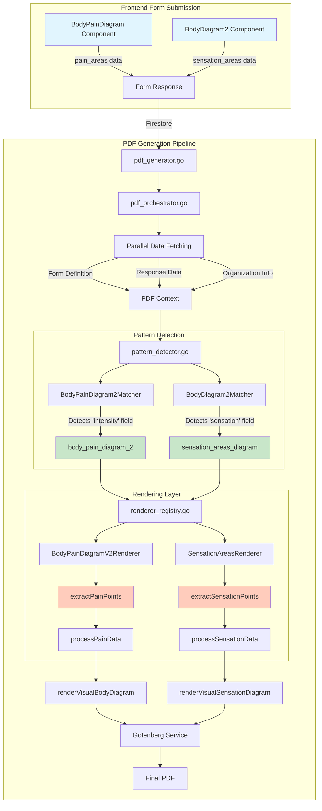

# Body Diagram Detection Logic - Implementation Status

## Current State Summary (August 14, 2025)

The body diagram PDF generation system is now **detecting both diagram types correctly** but the **visual rendering needs completion**. The pattern detection works, but the extracted data isn't being properly rendered into visual diagrams in the PDF.

## System Architecture Overview

### Two Distinct Body Diagram Types

1. **BodyPainDiagram** (`pain_areas` field)
   - Component: `BodyPainDiagram.tsx`
   - Type: `bodypaindiagram`
   - Data: Pain intensity levels (mild/moderate/severe)
   - Renderer: `BodyPainDiagramV2Renderer`

2. **BodyDiagram2** (`sensation_areas` field)
   - Component: `BodyDiagram2.tsx`
   - Type: `bodydiagram2`
   - Data: Sensation types (numbness/burning/pins_and_needles/etc)
   - Renderer: `SensationAreasRenderer`

## Data Flow Diagram



## Current Issues & Resolution Status

### ✅ RESOLVED Issues

1. **Pattern Detection** - Both diagram types are correctly identified
2. **Field Name Mapping** - `pain_areas` and `sensation_areas` are properly matched
3. **Renderer Registration** - Both renderers are registered in the registry
4. **Render Order** - Added `sensation_areas_diagram` to the default render order

### ❌ PENDING Issues

1. **Data Extraction Failure**
   - `extractSensationPoints()` returns empty array despite data being present
   - Debug logs added but need to verify data structure matches expectations
   - Likely mismatch between Firestore data structure and extraction logic

2. **Visual Rendering Incomplete**
   - SVG body diagram is embedded but markers aren't overlaying correctly
   - Need to verify coordinate system matches frontend implementation
   - Color coding and legends need refinement

## File Structure & Dependencies

### Active Files (Keep)
```
backend-go/internal/
├── api/
│   └── pdf_generator.go              # Entry point for PDF generation
├── services/
│   ├── pdf_orchestrator.go           # Main orchestration logic
│   ├── pattern_detector.go           # Pattern detection with matchers
│   ├── renderer_registry.go          # Renderer registration & management
│   ├── body_diagram_v2_renderer.go   # Both diagram renderers
│   ├── neck_disability_renderer.go   # NDI renderer
│   ├── oswestry_disability_renderer.go # ODI renderer
│   └── gotenberg_service.go          # PDF conversion service
```

### Duplicate Files (Can Remove)
```
backend-go/internal/services/renderers/
├── body_diagram_v2.go         ❌ Remove (duplicate)
├── insurance_card.go           ❌ Remove (placeholder in registry)
├── neck_disability_index.go    ❌ Remove (duplicate)
├── oswestry_disability.go      ❌ Remove (duplicate)
├── pain_assessment.go          ❌ Remove (placeholder in registry)
├── patient_demographics.go     ❌ Remove (placeholder in registry)
├── patient_vitals.go          ❌ Remove (placeholder in registry)
├── signature.go               ❌ Remove (placeholder in registry)
├── terms_checkbox.go          ❌ Remove (placeholder in registry)
├── terms_conditions.go        ❌ Remove (placeholder in registry)
└── templates/
    └── templates.go           ✅ Keep (used by registry)
```

## Debug Points for Completion

### 1. Data Structure Verification
```go
// Add logging at these points:
// - pdf_orchestrator.go: Log raw context.Answers
// - pattern_detector.go: Log detected field data structure
// - body_diagram_v2_renderer.go: Log extracted points before/after processing
```

### 2. Critical Functions to Debug
- `extractSensationPoints()` - Why returning empty?
- `processSensationData()` - Type assertions failing?
- `GetFloat64()`, `GetString()` - Helper functions parsing correctly?

### 3. Expected Data Structure
```json
// Frontend sends:
{
  "sensation_areas": [
    {
      "id": "sensation-1",
      "x": 45.2,
      "y": 32.1,
      "sensation": "numbness"
    }
  ]
}

// Backend expects same structure
// Verify Firestore isn't modifying it
```

## Next Steps for Completion

1. **Immediate Actions**
   - Run backend with debug logs enabled
   - Capture actual data structure from Firestore
   - Compare with expected structure
   - Fix type assertions/conversions

2. **Visual Rendering**
   - Verify SVG coordinate system (0-100% or pixel-based?)
   - Test marker positioning algorithm
   - Implement proper z-index layering
   - Add responsive scaling

3. **Testing**
   - Create comprehensive test with all sensation types
   - Test with multiple marks on same diagram
   - Verify PDF output matches frontend display
   - Test edge cases (empty data, invalid coordinates)

## Key Insights

1. **Dual Workflow Required**: The two diagram types must be handled completely separately as they have different data structures and visualization requirements.

2. **Pattern Detection Order Matters**: Specific matchers must run before generic ones to avoid incorrect matching.

3. **Type System Challenges**: Go's strict typing requires careful handling of Firestore's dynamic JSON data.

4. **Render Order Configuration**: Each pattern type must be explicitly added to the render order or it won't appear in the PDF.

---

*Last Updated: August 14, 2025*
*Status: Detection Working | Rendering Incomplete*