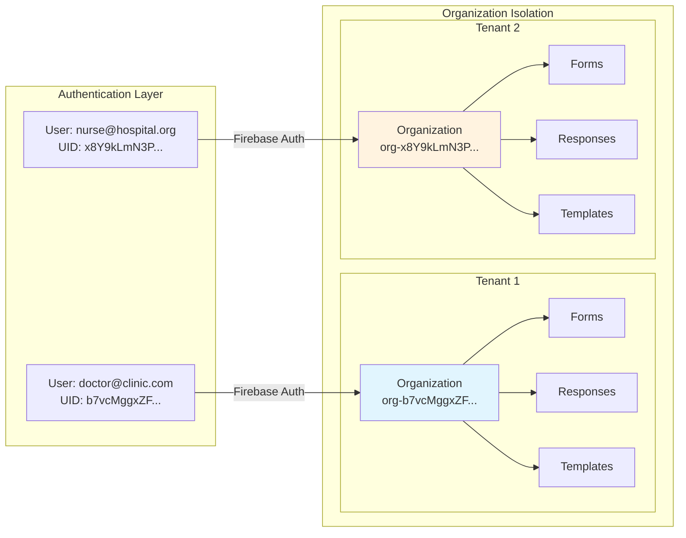
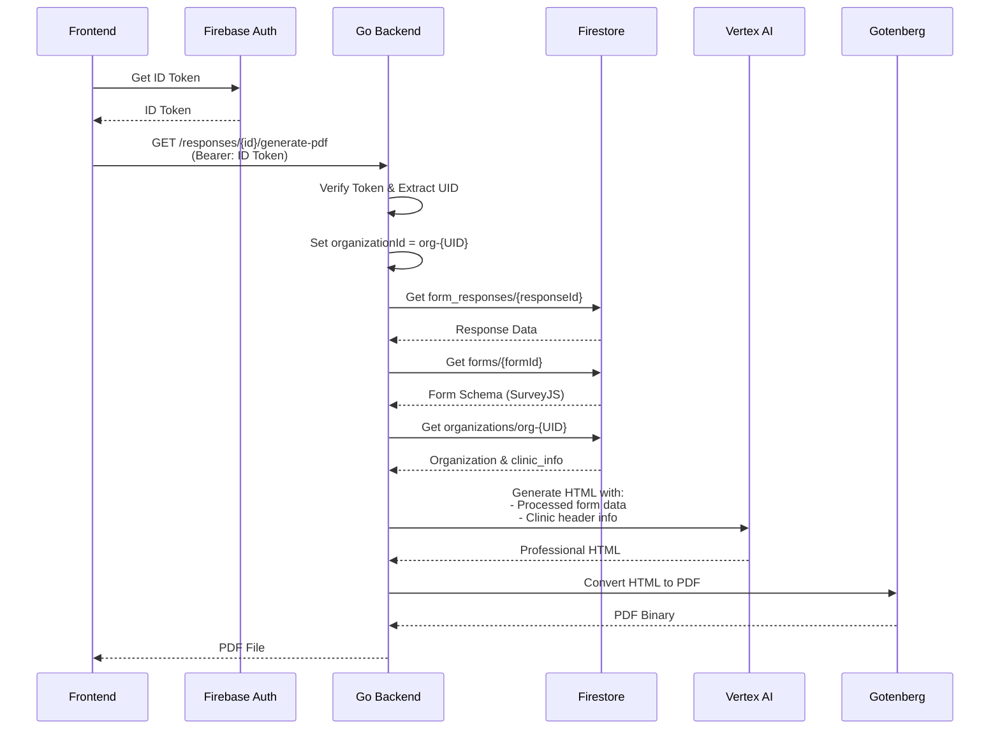
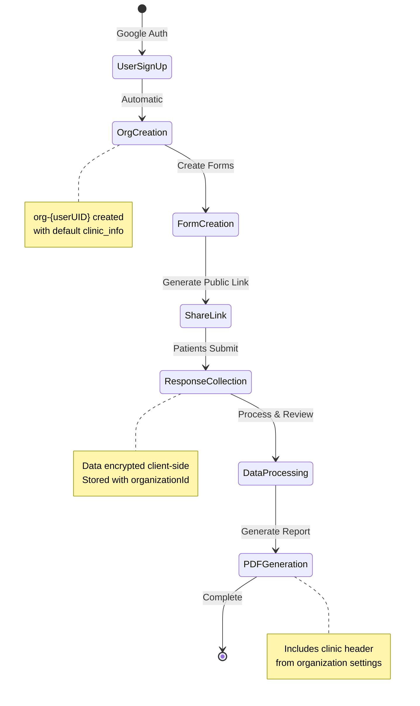

# Healthcare Forms Database Architecture

## Multi-Tenant NoSQL Structure (Firestore)

```mermaid
graph TB
    subgraph "Firebase Project: healthcare-forms-v2"
        subgraph "Firestore Collections"
            
            %% Organizations Collection
            subgraph "organizations/"
                ORG1["📁 org-{userUID}<br/>━━━━━━━━━━━━━━━━<br/>• uid: 'b7vcMggxZF...'<br/>• name: 'Personal Clinic'<br/>• email: 'doctor@clinic.com'<br/>• settings: {...}<br/>• clinic_info: {<br/>  - clinic_name<br/>  - address_line1<br/>  - city, state, zip<br/>  - phone, fax<br/>  - logo_url<br/>  - primary_color<br/>}<br/>• created_at<br/>• updated_at"]
            end
            
            %% Forms Collection
            subgraph "forms/"
                FORM1["📄 {formId}<br/>━━━━━━━━━━━━━━━━<br/>• organizationId: 'b7vcMggxZF...'<br/>• title: 'Patient Intake'<br/>• description: '...'<br/>• surveyJson: {SurveyJS schema}<br/>• isPublic: false<br/>• shareLinks: []<br/>• tags: ['medical', 'intake']<br/>• created_at<br/>• updated_at"]
            end
            
            %% Form Responses Collection
            subgraph "form_responses/"
                RESP1["📝 {responseId}<br/>━━━━━━━━━━━━━━━━<br/>• organizationId: 'b7vcMggxZF...'<br/>• formId: 'form123'<br/>• data: {encrypted answers}<br/>• patientName: 'John Doe'<br/>• status: 'completed'<br/>• isReviewed: false<br/>• submittedAt<br/>• signature: 'data:image/png...'"]
            end
            
            %% Form Templates Collection
            subgraph "form_templates/"
                TEMP1["📋 {templateId}<br/>━━━━━━━━━━━━━━━━<br/>• organizationId: 'b7vcMggxZF...'<br/>• name: 'COVID Screening'<br/>• category: 'screening'<br/>• surveyJson: {template}<br/>• isGlobal: false<br/>• created_at"]
            end
            
            %% Share Links Collection
            subgraph "share_links/"
                LINK1["🔗 {linkId}<br/>━━━━━━━━━━━━━━━━<br/>• formId: 'form123'<br/>• organizationId: 'b7vcMggxZF...'<br/>• token: 'abc123xyz'<br/>• expiresAt: timestamp<br/>• maxResponses: 100<br/>• responseCount: 15<br/>• isActive: true"]
            end
        end
    end
    
    %% Relationships
    ORG1 -.->|owns| FORM1
    ORG1 -.->|owns| RESP1
    ORG1 -.->|owns| TEMP1
    FORM1 -.->|generates| RESP1
    FORM1 -.->|has| LINK1
    TEMP1 -.->|creates| FORM1
```



## Multi-Tenancy Model



## Data Flow for PDF Generation



## Security & Isolation Rules

```yaml
Firestore Security Rules:
━━━━━━━━━━━━━━━━━━━━━━━━
organizations/{orgId}:
  - Read: if orgId == 'org-' + auth.uid
  - Write: if orgId == 'org-' + auth.uid

forms/{formId}:
  - Read: if resource.organizationId == auth.uid
  - Write: if request.resource.organizationId == auth.uid
  - Public Read: if resource.isPublic == true

form_responses/{responseId}:
  - Read: if resource.organizationId == auth.uid
  - Write: if request.resource.organizationId == auth.uid
  - Public Write: if via valid share_link token

share_links/{linkId}:
  - Read: if resource.organizationId == auth.uid
  - Write: if request.resource.organizationId == auth.uid
```

## Key Design Principles

### 1. Single-Tenant Per User Model
- Each user IS their own organization (`org-{userUID}`)
- Complete data isolation at the user level
- No cross-tenant data access possible

### 2. Document Structure
- **Flat collections** (no deep nesting)
- **organizationId** field on every document for filtering
- **Denormalized data** for read performance

### 3. Client-Side Encryption
- PHI data encrypted before storage
- Encryption keys stored in browser session only
- Automatic cleanup on navigation/timeout

### 4. Backend Validation
```go
// Every authenticated request:
1. Extract UID from Firebase token
2. Set organizationId = "org-" + UID  
3. Filter ALL queries by organizationId
4. Validate ownership before mutations
```

### 5. Collection Naming Convention
- `form_responses` (not `responses`) - production collection
- Lowercase with underscores
- Plural names for collections
- Document IDs are auto-generated UUIDs

## Data Lifecycle



## Migration Path (FastAPI → Go)
- Same Firestore structure maintained
- Collection names unchanged
- Document schemas preserved
- Only backend implementation changed

This architecture ensures:
- **HIPAA Compliance** through encryption and isolation
- **Scalability** through NoSQL document model
- **Multi-tenancy** through UID-based isolation
- **Simplicity** through single-tenant-per-user model