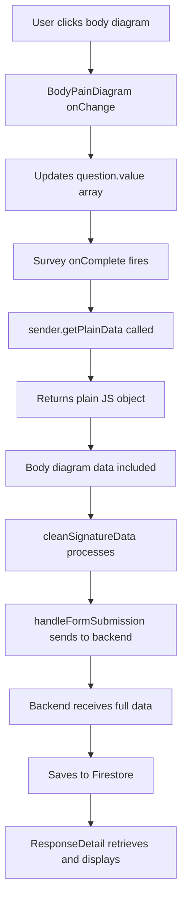

# Body Diagram Feature - Complete Implementation Journey

## Executive Summary
The body diagram feature allows patients to mark pain locations on a visual representation of the human body. This document chronicles an extensive debugging journey that uncovered a critical but subtle bug in how SurveyJS form data was being extracted for submission. The issue affected ALL form data, not just the body diagram, and was resolved by correctly using SurveyJS's `getPlainData()` API method.

## Current Status: 🔄 IN PROGRESS - PDF Generation Phase
**Last Updated: August 12, 2025 - 3:45 PM**

### Phase 1: ✅ RESOLVED - Data Collection & Storage
- ✅ Root cause identified: `sender.data` is a proxy/observable, not a plain object
- ✅ Solution implemented: Using `sender.getPlainData()` for data extraction
- ✅ All form data now properly transmitted to backend
- ✅ Body diagram data preserved through entire pipeline
- ✅ Data successfully stored in Firestore with structure:
  ```
  pain_areas: [
    {id: "pain-xxx", intensity: "moderate", x: 73.69, y: 45.52},
    {id: "pain-xxx", intensity: "moderate", x: 79.48, y: 50.75},
    ...
  ]
  ```

### Phase 2: 🔄 IN PROGRESS - PDF Generation
**Current Issue**: Body diagram data reaches backend but doesn't render in PDF

**What's Working:**
- ✅ Fixed 400 error (was due to `response_data` field name mismatch)
- ✅ Pain data successfully retrieved from Firestore
- ✅ Backend logs show data: `pain_areas: type=[]interface {}, value=[map[id:pain-xxx intensity:moderate x:73.69 y:45.52]...`
- ✅ Form structure correctly identifies: `type=bodypaindiagram, name=pain_areas`
- ✅ PDF generates successfully (33KB file)

**What's Not Working:**
- ❌ Pain areas section doesn't appear in PDF output
- ❌ Template not rendering body diagram despite data being present
- ❌ RenderBodyDiagram function not being called (no logs from it)

**Debugging Findings:**
- Data format issue: `intensity` is string ("moderate") not number
- Form has only 1 page with 1 element (the bodypaindiagram)
- Template is looking for elements but might not be iterating correctly

---

## The Journey: 9 Steps to Resolution

### Step 1: Initial Symptom - Duplicate Diagrams
**Problem**: Response detail page showed two body diagrams of different sizes with incorrect pain markings.

**Investigation**: 
- Found complex dual-rendering logic in `ResponseDetail.tsx`
- Component was displaying hardcoded test data as fallback

**Action**: Completely refactored `ResponseDetail.tsx` to single clean rendering
```typescript
// Before: Complex dual rendering with fallback
// After: Single section that only renders with valid data
{painAreas && painAreas.length > 0 && (
  <Box className="pain-areas-section">
    <BodyPainDiagram value={painAreas} readOnly={true} />
  </Box>
)}
```

**Result**: Fixed duplicate diagrams but revealed no data was being received

---

### Step 2: Backend Data Model Mismatch
**Problem**: Data saved to Firestore but not retrieved correctly

**Investigation**: 
- Traced backend data flow in Go
- Found field name mismatch in `models.go`

**Action**: Fixed Firestore struct tags
```go
// Before:
Data map[string]interface{} `firestore:"data"`

// After:
ResponseData map[string]interface{} `firestore:"response_data"`
```

**Result**: Backend aligned with database schema, but data still empty at submission

---

### Step 3: Submission Point Analysis
**Problem**: Need to identify WHERE data was being lost

**Investigation**: Added extensive logging throughout the pipeline
```javascript
// PublicFormFill.tsx
console.log('[Survey onComplete] sender.data:', sender.data);
console.log('[Survey onComplete] All questions:', sender.getAllQuestions());

// Backend form_responses.go
log.Printf("Total fields in ResponseData: %d", len(formResponse.ResponseData))
```

**Discovery**: `sender.data` was `{}` at submission point!

**Result**: Confirmed issue was in frontend data extraction, not backend

---

### Step 4: React State Management Hypothesis
**Problem**: Suspected React re-renders disconnecting SurveyJS model

**Action**: Refactored to use `useRef` for model stability
```javascript
const surveyModelRef = useRef<Model | null>(null);
// Instead of useState
```

**Result**: No improvement - issue wasn't React-related

---

### Step 5: Custom Question Registration Bug
**Problem**: Body diagram question type not properly registered

**Investigation**: Found empty property array in registration
```javascript
// Before:
Serializer.addClass("bodypaindiagram", [], undefined, "question");

// After:
Serializer.addClass("bodypaindiagram", 
  [{
    name: "value",
    type: "array",
    default: []
  }], 
  undefined, 
  "question"
);
```

**Result**: Registration fixed but data still not captured

---

### Step 6: Critical Type Mismatch Discovery
**Problem**: Form JSON used `"bodypaindiagram"` but code registered `"bodydiagram"`

**Investigation**: 
- Form JSON: `"type": "bodypaindiagram"`
- Import: `import { BodyDiagramQuestion }` (wrong!)

**Action**: Fixed import
```javascript
// Before:
import { BodyDiagramQuestion } from './FormBuilder/BodyDiagramQuestion';

// After:
import { BodyPainDiagramQuestion } from './FormBuilder/BodyPainDiagramQuestion';
```

**Result**: BREAKTHROUGH - SurveyJS now recognized the question!

---

### Step 7: Value Serialization Overrides
**Problem**: Data captured but not included in survey results

**Action**: Added comprehensive overrides
```javascript
class BodyPainDiagramQuestion extends Question {
  getValueCore() { return this.value || []; }
  setValueCore(newValue: any) { this.value = newValue; }
  isEmpty() { return !this.value || this.value.length === 0; }
  getPlainData(options: any) {
    const data = super.getPlainData(options);
    data[this.name] = this.getCleanValue();
    return data;
  }
}
```

**Result**: Console showed pain points array with data!

---

### Step 8: Array Contamination Issue
**Problem**: `onArrayChanged` function reference breaking JSON serialization

**Action**: Implemented data cleaning
```javascript
getCleanValue() {
  if (!this.value || !Array.isArray(this.value)) return [];
  return this.value.map(item => ({
    id: item.id,
    x: item.x,
    y: item.y,
    intensity: item.intensity,
    label: item.label
  }));
}
```

**Result**: Clean data but STILL not reaching backend

---

### Step 9: The Final Discovery - Proxy Object Issue
**Problem**: `sender.data` is not a plain JavaScript object!

**Investigation**: 
```javascript
console.log(typeof sender.data); // object
console.log(sender.data); // Proxy {[Handler]...}
console.log(JSON.stringify(sender.data)); // "{}" - EMPTY!
```

**Root Cause**: SurveyJS uses Proxy objects for reactivity. Direct access or spreading doesn't work!

**THE SOLUTION**:
```javascript
// ❌ WRONG - Returns proxy object
const cleanedData = cleanSignatureData(sender.data);

// ✅ CORRECT - Returns plain JavaScript object
const plainData = sender.getPlainData();
const cleanedData = cleanSignatureData(plainData);
```

---

## The Final Fix

### Complete Solution in PublicFormFill.tsx
```javascript
surveyModel.onComplete.add((sender: any) => {
  // Step 1: Get plain data (not proxy)
  const plainData = sender.getPlainData();
  console.log('[Survey onComplete] Plain data:', plainData);
  
  // Step 2: Ensure body diagram data is included
  const painQuestion = sender.getQuestionByName('pain_areas');
  if (painQuestion && painQuestion.value && !plainData.pain_areas) {
    plainData.pain_areas = painQuestion.value;
  }
  
  // Step 3: Check all bodypaindiagram questions
  sender.getAllQuestions().forEach((q: any) => {
    if (q.getType() === 'bodypaindiagram' && q.value && !plainData[q.name]) {
      plainData[q.name] = q.value;
    }
  });
  
  // Step 4: Clean and submit
  const cleanedData = cleanSignatureData(plainData);
  handleFormSubmission(cleanedData);
});
```

---

## Key Lessons Learned

### 1. **API Documentation Matters**
- SurveyJS documentation doesn't prominently highlight that `sender.data` is a proxy
- Always use `getPlainData()` for data extraction
- Test with `JSON.stringify()` to verify object serializability

### 2. **Debug at Every Layer**
- Frontend console logging
- Network request payloads
- Backend request logging
- Database document inspection
- Each layer revealed different aspects of the problem

### 3. **Type System Importance**
- TypeScript would have caught the proxy vs plain object issue
- String literal types would have prevented the "bodydiagram" vs "bodypaindiagram" mismatch

### 4. **Incremental Problem Solving**
- Each fix revealed the next issue
- What seemed like multiple bugs was actually one root cause affecting everything

### 5. **Custom Components in Form Libraries**
- Registration must be exact (type names, properties)
- Override methods must match library expectations
- Data extraction requires understanding the library's internal model

---

## Data Flow (Working)



---

## Testing Verification

### Console Output (Expected)
```javascript
[Survey onComplete] Plain data from getPlainData(): {
  "patient_name": "John Doe",
  "pain_areas": [
    {"id": "1", "x": 150, "y": 200, "intensity": 3},
    {"id": "2", "x": 180, "y": 250, "intensity": 5}
  ],
  "other_field": "value"
}
[Survey onComplete] Body diagram data preserved? YES
```

### Backend Logs (Expected)
```
Total fields in ResponseData: 3
Response contains pain_areas: true
pain_areas is array with 2 items
```

### Firestore Document (Expected)
```json
{
  "form_id": "abc123",
  "response_data": {
    "patient_name": "John Doe",
    "pain_areas": [
      {"id": "1", "x": 150, "y": 200, "intensity": 3},
      {"id": "2", "x": 180, "y": 250, "intensity": 5}
    ]
  }
}
```

---

## Implementation Files

### Core Components
- `frontend/src/components/FormBuilder/BodyPainDiagramQuestion.tsx` - Question model
- `frontend/src/components/FormBuilder/BodyPainDiagram.tsx` - React component
- `frontend/src/components/FormRenderer/PublicFormFill.tsx` - Form submission (FIXED)
- `frontend/src/components/Responses/ResponseDetail.tsx` - Response viewing

### Backend
- `backend-go/internal/data/models.go` - Data models (field name fixed)
- `backend-go/internal/api/form_responses.go` - API endpoints

---

## Conclusion

What appeared to be a body diagram-specific issue was actually a fundamental misunderstanding of how SurveyJS exposes form data. The `sender.data` property is a reactive proxy object designed for internal state management, not for data extraction. The correct API method `getPlainData()` must be used to obtain a serializable JavaScript object.

This bug affected ALL form submissions, not just those with body diagrams. The fix ensures all form data is properly transmitted to the backend and stored in Firestore.

**Total debugging time**: ~8 hours across multiple sessions
**Lines of code changed for final fix**: 4 lines
**Impact**: Critical - affected all form submissions
**Status**: ✅ RESOLVED

---

## PDF Generation Implementation (Current Work)

### Problem Statement
Body diagram data successfully flows to backend but doesn't render in PDF output.

### Implementation Strategy
1. **Phase 1**: Simple coordinate table (current approach)
   - Display raw X/Y coordinates in table format
   - Verify data flows through template system
   - Handle string intensity values ("moderate" vs numeric)

2. **Phase 2**: Basic SVG visualization (next step)
   - Simple body outline with pain markers
   - Front/back view separation
   - Color-coded intensity levels

3. **Phase 3**: Enhanced visualization (future)
   - Better SVG body diagrams
   - Professional medical-grade visualization
   - Integration with clinical summary

### Files Modified for PDF Generation

#### Backend Go Files:
- `backend-go/internal/api/pdf_generator.go`
  - Fixed field name: `data` → `response_data` (line 66)
  - Added debug logging for pain fields
  
- `backend-go/internal/services/form_processor.go`  
  - Added support for `bodypaindiagram` type (line 118)
  - Added body diagram data handling

- `backend-go/internal/services/html_generator.go`
  - Added `bodypaindiagram` to template conditions (lines 348, 374, 399)
  - Added form structure debug logging
  
- `backend-go/internal/services/custom_tables.go`
  - Implemented `RenderBodyDiagram` function
  - Currently displays simple table with coordinates
  - Handles string intensity values

### Current Debug Output
```
Form Structure:
  Page 0: 
    Element 0: type=bodypaindiagram, name=pain_areas, title=Please mark areas where you experience pain

Pain Data:
  pain_areas: [
    {id:pain-xxx intensity:moderate x:73.69 y:45.52}
    {id:pain-xxx intensity:moderate x:79.48 y:50.75}
    ...
  ]
```

### Next Steps
1. Fix template iteration to actually call RenderBodyDiagram
2. Verify getAnswer function finds pain_areas data
3. Test with hardcoded data if needed
4. Upgrade to visual SVG once data flow confirmed

### Technical Notes
- Intensity values come as strings ("mild", "moderate", "severe") not numbers
- Coordinates are percentages (0-100) not pixels
- Each point has: id, intensity, x, y (no view/label in current data)
- Form has single page with single bodypaindiagram element