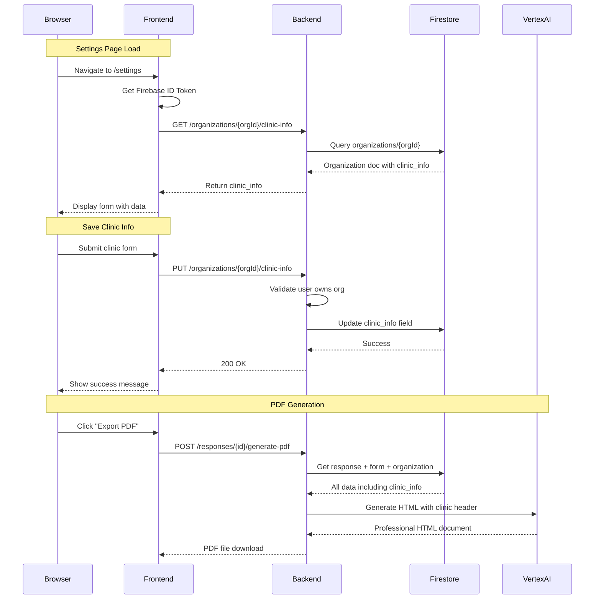

# Clinic Location Feature - Complete Implementation Guide

## Overview
The Clinic Location feature allows healthcare organizations to store and manage their clinic information (address, contact details, branding) that automatically appears on all generated PDF documents. This ensures professional, branded medical documents with consistent headers.

## Feature Components

### 1. Database Schema

#### Firestore Document Structure
```typescript
// organizations/{orgId} document
{
  _id: "org-{userUID}",
  uid: "{userUID}",
  name: "Clinic Name",
  email: "clinic@example.com",
  settings: {
    hipaa_compliant: true,
    data_retention_days: 2555,
    timezone: "America/New_York"
  },
  clinic_info: {
    // Core Information
    clinic_name: "Advanced Medical Center",
    address_line1: "123 Healthcare Blvd",
    address_line2: "Suite 400",  // optional
    city: "San Francisco",
    state: "CA",
    zip_code: "94102",
    
    // Contact Details
    phone: "(415) 555-0100",
    fax: "(415) 555-0101",      // optional
    email: "info@advancedmed.com",
    website: "https://advancedmed.com", // optional
    
    // Professional Identifiers
    tax_id: "12-3456789",        // optional
    npi: "1234567890",           // optional - National Provider Identifier
    
    // Branding
    logo_url: "https://...",     // optional
    primary_color: "#2c3e50",    // optional - header background
    secondary_color: "#3498db"   // optional - accent color
  },
  created_at: timestamp,
  updated_at: timestamp
}
```

### 2. Backend Implementation (Go)

#### Data Models
**File:** `backend-go/internal/data/models.go`
```go
type ClinicInfo struct {
    ClinicName     string `json:"clinic_name" firestore:"clinic_name"`
    AddressLine1   string `json:"address_line1" firestore:"address_line1"`
    AddressLine2   string `json:"address_line2,omitempty" firestore:"address_line2,omitempty"`
    City           string `json:"city" firestore:"city"`
    State          string `json:"state" firestore:"state"`
    ZipCode        string `json:"zip_code" firestore:"zip_code"`
    Phone          string `json:"phone" firestore:"phone"`
    Fax            string `json:"fax,omitempty" firestore:"fax,omitempty"`
    Email          string `json:"email" firestore:"email"`
    Website        string `json:"website,omitempty" firestore:"website,omitempty"`
    TaxID          string `json:"tax_id,omitempty" firestore:"tax_id,omitempty"`
    NPI            string `json:"npi,omitempty" firestore:"npi,omitempty"`
    LogoURL        string `json:"logo_url,omitempty" firestore:"logo_url,omitempty"`
    PrimaryColor   string `json:"primary_color,omitempty" firestore:"primary_color,omitempty"`
    SecondaryColor string `json:"secondary_color,omitempty" firestore:"secondary_color,omitempty"`
}

type Organization struct {
    ID         string               `json:"_id,omitempty" firestore:"_id,omitempty"`
    UID        string               `json:"uid" firestore:"uid"`
    Name       string               `json:"name" firestore:"name"`
    Email      string               `json:"email,omitempty" firestore:"email,omitempty"`
    Settings   OrganizationSettings `json:"settings" firestore:"settings"`
    ClinicInfo ClinicInfo          `json:"clinic_info" firestore:"clinic_info"`
    CreatedAt  time.Time           `json:"created_at" firestore:"created_at"`
    UpdatedAt  time.Time           `json:"updated_at" firestore:"updated_at"`
}
```

#### API Endpoints
**File:** `backend-go/internal/api/organizations.go`

```go
// GET /api/organizations/current
// Auto-creates organization if doesn't exist
GetOrCreateUserOrganization(client *firestore.Client)

// GET /api/organizations/:id/clinic-info
// Returns clinic information for the organization
GetOrganizationClinicInfo(client *firestore.Client)

// PUT /api/organizations/:id/clinic-info
// Updates clinic information
UpdateOrganizationClinicInfo(client *firestore.Client)
```

#### Authentication Middleware
**File:** `backend-go/internal/api/middleware.go`
```go
// Sets context values:
c.Set("uid", token.UID)
c.Set("email", token.Claims["email"])
c.Set("organizationId", token.UID)
```

### 3. Frontend Implementation (React)

#### Settings Component
**File:** `frontend/src/components/Settings/ClinicSettings.tsx`
- Form for editing clinic information
- Auto-saves to backend
- Real-time validation
- Phone number formatting
- Color picker for branding

#### API Integration
**File:** `frontend/src/store/api/organizationsApi.ts`
```typescript
interface ClinicInfo {
  clinic_name: string;
  address_line1: string;
  address_line2?: string;
  city: string;
  state: string;
  zip_code: string;
  phone: string;
  fax?: string;
  email: string;
  website?: string;
  tax_id?: string;
  npi?: string;
  logo_url?: string;
  primary_color?: string;
  secondary_color?: string;
}

// RTK Query endpoints
- useGetClinicInfoQuery(orgId)
- useUpdateClinicInfoMutation()
```

#### Authentication Context
**File:** `frontend/src/contexts/FirebaseAuthContext.tsx`
- Fetches/creates organization on login
- Sets organization in Redux store
- Organization ID format: `org-{userUID}`

### 4. PDF Generation Integration

#### PDF Generator
**File:** `backend-go/internal/api/pdf_generator.go`
```go
// GeneratePDFHandler process:
1. Fetch form response from Firestore
2. Fetch form schema (SurveyJS)
3. Fetch organization with clinic_info ← NEW
4. Process form with conditional logic
5. Send to Vertex AI with clinic header
6. Convert HTML to PDF via Gotenberg
```

#### Vertex AI Service
**File:** `backend-go/internal/services/vertex_service.go`
```go
func GeneratePDFHTMLWithClinic(
    ctx context.Context, 
    questions []VisibleQuestion, 
    clinicInfo *data.ClinicInfo
) (string, error)
```

The AI prompt includes instructions to:
- Create professional header with clinic info
- Display clinic name prominently
- Include full address formatting
- Add phone/fax with proper formatting
- Include logo if provided
- Apply primary color to header
- Add "Confidential Medical Information" footer

## API Flow Diagram



## Dependencies

### Backend Dependencies
```go
// go.mod
require (
    cloud.google.com/go/firestore v1.14.0
    cloud.google.com/go/vertexai v0.7.1
    firebase.google.com/go/v4 v4.13.0
    github.com/gin-gonic/gin v1.9.1
    google.golang.org/grpc v1.60.1
)
```

### Frontend Dependencies
```json
// package.json
{
  "@reduxjs/toolkit": "^2.0.1",
  "@mui/material": "^5.15.2",
  "axios": "^1.6.3",
  "firebase": "^10.7.1",
  "react": "^18.2.0",
  "react-redux": "^9.0.4"
}
```

## Security Considerations

1. **Data Isolation**
   - Each user can only access their own organization
   - Organization ID derived from Firebase UID
   - Backend validates ownership on every request

2. **Authentication Flow**
   - Firebase ID token required for all API calls
   - Token verified by backend middleware
   - Session cookies for web security

3. **Input Validation**
   - Phone numbers auto-formatted
   - State codes limited to 2 characters
   - Email validation on frontend
   - URL validation for logo/website

## Troubleshooting Guide

### Common Issues

1. **401 Unauthorized Errors**
   - Check Firebase ID token vs session token
   - Verify axios interceptor not overriding auth header
   - Ensure organization ID matches user UID

2. **Clinic Info Not Saving**
   - Verify organization exists in Firestore
   - Check organization ID format (`org-{uid}`)
   - Confirm backend middleware sets context values

3. **PDF Not Showing Clinic Header**
   - Verify clinic_info exists in organization document
   - Check Vertex AI prompt includes clinic instructions
   - Ensure PDF generator fetches organization data

### Debug Commands

```bash
# Check backend logs
gcloud run services logs read healthcare-forms-backend-go \
  --region us-central1 --limit 50

# Filter for clinic-related logs
gcloud run services logs read healthcare-forms-backend-go \
  --region us-central1 --limit 50 | grep -i clinic

# Check organization in Firestore (use Firebase Console)
# Path: organizations/org-{userUID}
```

## Testing Checklist

- [ ] User can navigate to Settings page
- [ ] Existing clinic info loads correctly
- [ ] Form validates required fields
- [ ] Phone numbers auto-format
- [ ] Save button shows loading state
- [ ] Success message appears after save
- [ ] Data persists after page refresh
- [ ] PDF generation includes clinic header
- [ ] Clinic colors apply to PDF header
- [ ] Logo appears in PDF if provided

## Future Enhancements

1. **Multiple Locations**
   - Support for multiple clinic addresses
   - Location selector on form creation

2. **Rich Branding**
   - Custom fonts
   - Header templates
   - Watermarks

3. **Compliance Fields**
   - CLIA number
   - State medical license
   - DEA number

4. **Automatic Formatting**
   - Address validation via API
   - Phone number country codes
   - NPI number validation